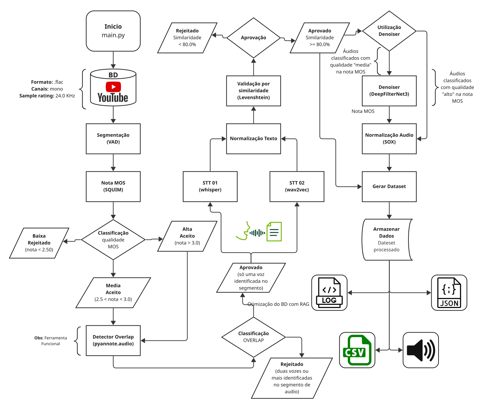

# katube-2026 — Audio Processing Pipeline

Modular pipeline that turns raw audio, from **any source**, into a
**clean, transcribed dataset for training TTS/STT models** in Brazilian
Portuguese.

The input is a collection of audio files; the output is a `dataset.csv` with
short, normalized segments, transcribed by two STT models and validated by
similarity, plus the corresponding audio files. **The final audio's
characteristics are not fixed**: sample rate, bit depth, number of channels,
file format, volume normalization method and target level are all defined in
the `SOX_NORMALIZER` block of [config.py](config.py) —
see [Outputs (the dataset)](#outputs-the-dataset).

---

## Overview

```
Raw audio (.ogg/.flac/...) pasted into arquivos/input/
        │
        ▼
┌──────────────────────── main.py (orchestrator) ────────────────────────┐
│  M00 ── naming: scans input/, resolves the id and MOVES to audios/     │
│         │                                                              │
│         ▼                                                              │
│  arquivos/audios/{audio_id}/{audio_id}.ext                             │
│         │                                                              │
│         ▼                                                              │
│  M02 → M04 → M05 → M06 → M07 → M08 → M09 → M10 → M11 → M12 → M13 → M14 → M15  │
└─────────────────────────────────────────────────────────────────────────┘
        │
        ▼
dataset/dataset.csv  +  dataset/audio_dataset/{audio_id}/*.{output format}
```

Each audio file is identified by an **`audio_id`**, decided by M00: the MD5
hash of the file's **content** (recommended mode) or the original name — see
`NOMEACAO` in [config.py](config.py). All intermediate state for an audio
file lives in `arquivos/temp/{audio_id}/`, organized into numbered subfolders
that mirror the pipeline stages.

> **ATTENTION — `arquivos/input/` is emptied on every run.** M00 **moves**
> the files, it does not copy them. **Always paste a COPY into
> `arquivos/input/`, never the only copy of the audio files** — they are
> consumed during processing. See
> [arquivos/input/README.md](arquivos/input/README.md).

---

## Flow diagram



The diagram above is an export of the Miro board, which is always the
up-to-date source:
https://miro.com/app/board/uXjVG9eNQ_g=/?focusWidget=3458764660637824545

---

## Project structure

```
katube-2026/
├── main.py                  # Orchestrator: runs M02→M15 for each audio file
├── config.py                # ALL the configuration (MASTER block + per-module params)
├── requirements-servidor.txt # Pinned versions of the reference environment
├── .env.example             # Template for the .env (HuggingFace token)
├── .gitignore               # What stays out of version control (audio, dataset, .env)
├── README.md                # This document: overview, pipeline and outputs
├── INSTALL.md                # Environment setup and verification
├── Alcateia_-_Fluxo_Katube_VAD_2026.svg  # Flow diagram
├── src/                     # Pipeline modules (m00-m15)
│   ├── m00_nomeacao.py               # Entry point: input/ → audios/{id}/{id}.ext
│   ├── m01_load_models.py            # AI model singleton (loads once)
│   ├── m02_diretorios.py             # Creates audio folders and converts input to WAV
│   ├── m04_segmentador_audio_vad.py  # VAD segmentation (Silero)
│   ├── m05_segmentador_16khz.py      # Conversion to 16 kHz mono
│   ├── m06_mos_filter.py             # MOS quality filter (SQUIM)
│   ├── m07_overlap1.py               # Speaker overlap detection (pyannote)
│   ├── m08_whisper.py                # STT with distil-Whisper PT-BR
│   ├── m09_wav2vec.py                # STT with Wav2Vec2 PT-BR
│   ├── m10_texto_normalizador.py     # Text normalization
│   ├── m11_validador_similaridade.py # Similarity validation (WER, CER, Levenshtein)
│   ├── m12_denoiser_deepfilternet3.py# Denoising (DeepFilterNet3)
│   ├── m13_normalizador_audio.py     # Audio normalization (SoX)
│   ├── m14_metadados.py              # Writes dataset.csv (append) + history
│   └── m15_cleanup.py                # Cleans up temp/input
├── arquivos/
│   ├── input/                        # INPUT: paste here (EMPTIED on every run)
│   │   └── README.md                 # How to prepare input material
│   ├── audios/                       # Working folder: one {audio_id} subfolder per audio
│   │   └── README.md                 # Working folder structure
│   └── temp/                         # Intermediate state: one {audio_id} subfolder (see below)
│       └── README.md                 # Structure of the intermediate subfolders
├── audiosTestes/{nome}/              # Reference audio files for testing (ignored by git)
└── dataset/
    ├── sumary_results.py             # Summarizes dataset results
    ├── dataset.csv                   # OUTPUT: metadata for each approved segment
    ├── nomeacao.csv                  # Provenance: id ↔ source path
    ├── concluidos.csv                # Deduplication: which audio finished the pipeline
    ├── processamento_metadados.csv   # Run log: duration and time per module
    ├── audio_dataset/{audio_id}/     # OUTPUT: final audio segments
    ├── historico_dataset/{id}.json   # Backup of the per-audio tracking JSON
    └── log/{audio_id}.log            # Detailed per-audio log
```

### Subfolders of `arquivos/temp/{audio_id}/`

Created by **M02** and consumed/filled by the following modules:

| Folder | Content | Module |
|-------|----------|--------|
| `00-json_dinamico/`     | Tracking JSON (state of each segment) | all |
| `01-arquivos_originais/`| Copy of the input audio file | M02 |
| `02-segmentos_originais/`| Segments at the original sample rate | M04 |
| `03-segments_16khz/`    | Segments converted to 16 kHz | M05 |
| `04-mos_score/`         | MOS filter results | M06 |
| `05-overlap1/`          | Overlap detection results | M07 |
| `06-stt_whisper/`       | Whisper transcriptions | M08 |
| `07-stt_wav2vec/`       | Wav2Vec2 transcriptions | M09 |
| `08-normalizador_texto/`| Normalized texts | M10 |
| `09-validacao_similaridade/`| Similarity metrics | M11 |
| `10-denoiser/`          | Audio files after denoising | M12 |
| `11-normalizador_audio/`| Final normalized audio files (SoX) | M13 |

The **`00-json_dinamico/{audio_id}_segments_acompanhamento.json`** is the
heart of the pipeline: each module reads and enriches this JSON with its
fields, and at the end M14 converts it into rows of `dataset.csv`.

---

## The pipeline, step by step

The orchestrator ([main.py](main.py)) runs **M00 only once**, then iterates
over every `audio_id` in `arquivos/audios/`, skips those that already have
history, and runs the steps below for each new audio file. Steps marked
**(conditional)** only run according to the `MASTER` block in
[config.py](config.py).

### M00 — Naming *(required, runs once per execution)*
Scans `arquivos/input/` **recursively**, filters by the formats in
`NOMEACAO['formatos_entrada']`, resolves the `audio_id` for each file and
**MOVES** it to `arquivos/audios/{audio_id}/{audio_id}.ext`.

- **Id**: per `NOMEACAO['modo']`, always **deterministic** (the same input
  always produces the same id):
  - **`hash_md5` — RECOMMENDED.** The id is the MD5 of the **file's bytes**.
    Three gains at once: (1) two audio files with **different content** and
    the same name generate different ids and **both get in** — new material
    is no longer lost; (2) the **same** file pasted into another folder
    generates the **same** id and is recognized as a repeat, so resuming
    after a break survives until the source folder is renamed; (3) a safe id
    by construction — 32 hexadecimal characters, with no space, accent or
    the `|` that would break the CSV row.
  - **`nome_original`**: the id is the name without the extension. Readable,
    but collides between batches — two batches with `entrevista.flac`
    compete for the same id and the second one is blocked **even if the
    content is different**.
- **Hash mode limitation**: it detects an **identical file**, not "the same
  sound content". The same audio re-exported, with different metadata or
  converted to another format, generates a different hash and **passes as
  new**.
- **Why not hash the metadata** (timestamp, size): the timestamp **does not
  survive** copying, downloading, zip extraction, cloud sync or transfer to
  the server. The same audio file would arrive at AWS with a different id,
  guaranteeing a duplicate on every transfer — which is exactly this
  project's workflow.
- **Hash cost**: measured at 0.003% of a CPU run (73 ms for 13.4 MB),
  projected at ~0.03% on GPU. It is disk I/O, not model computation, so it
  does not speed up on GPU — but it starts from a negligible baseline.
- **Repeated names** in different folders get a `_002`, `_003` suffix, in
  the alphabetical order of the relative path — **only in `nome_original`
  mode**. In hash mode there is no tie-break: two files with the same name
  are already distinguished by content, and if the content is the same they
  are the same audio and should collide.
- **Does not move** what is already in `arquivos/audios/{id}/` (guard 1) or
  what is already listed in `dataset/concluidos.csv` (guard 2). The file
  stays put in `input/`, named in the log, with the guard that blocked it
  and the count in the footer.
- A file with an unaccepted format is **ignored with a warning and a
  count**, and it does not move.
- Records the provenance of each moved audio file in `dataset/nomeacao.csv`
  (`|` separator, **pure append**, in both modes). This is the source of the
  `nome_original` column in `dataset.csv`.

**The `arquivos/input/` folder is emptied on every run — always paste a
copy.**

### M02 — Create directories *(required)*
Creates `arquivos/temp/{audio_id}/` with all the numbered subfolders and
**converts** the input audio to **WAV** in `01-arquivos_originais/`,
preserving the original's sample rate, channels and bit depth (24 bits
become `pcm_s24le`, not truncated). WAV is the pipeline's internal format:
from this point on the input format no longer circulates, which allows
accepting formats that SoX cannot read (`m4a`, `aac`, `wma`). It also
ensures the existence of `dataset/audio_dataset/`,
`dataset/historico_dataset/` and `dataset/log/`.

### M04 — Segmentation *(conditional)*
Breaks the long audio file into short speech segments. Mode defined by
`MASTER['segmentacao']`:
- **`'vad'`** (default): uses **Silero-VAD** to detect speech/silence and
  cut at natural pauses. Parameters in `SEGMENTADOR_AUDIO_VAD` (voice
  threshold, min/max segment durations, padding on the cuts). If no valid
  segment is found, the audio file is **discarded**.
- **`''`**: skips (audio already comes segmented).

Output: segments in `02-segmentos_originais/`.

### M05 — 16 kHz conversion *(required)*
Converts each segment to **16 kHz mono**, the format expected by the
downstream AI models. Output in `03-segments_16khz/`.

### M06 — MOS filter *(conditional — `mos_filter`)*
Evaluates the perceived quality of each segment with the **SQUIM** model
(MOS, STOI, SI-SDR). Classifies as `alta`/`media`/`baixa` according to
`MOS_FILTER['thresholds']` and **discards** segments below `min_threshold`.
This classification also decides what the denoiser (M12) processes.

### M07 — Overlap detection *(conditional — `overlap`)*
Uses **pyannote** (`speaker-diarization-3.1`) to detect speaker overlap (two
people talking at the same time). Segments with overlap are flagged to be
filtered out — TTS/STT training audio must have a single speaker per
segment.

### M08 — Whisper transcription *(conditional — `transcricao_whisper`)*
Transcribes each segment with **`freds0/distil-whisper-large-v3-ptbr`**.
Field `stt_whisper`.

### M09 — Wav2Vec2 transcription *(conditional — `transcricao_wav2vec`)*
Transcribes with
**`lgris/wav2vec2-large-xlsr-open-brazilian-portuguese`**. Field
`stt_wav2vec`. Having **two independent transcriptions** allows quality to
be validated by agreement (M11).

### M10 — Text normalization *(required)*
Normalizes the transcriptions according to `TEXT_NORMALIZER`: removes
punctuation that affects diction and, optionally, diacritics. Produces the
`*_normalizado` fields used only for comparison.

### M11 — Similarity validation *(required)*
Compares the two normalized transcriptions against each other (Whisper ×
Wav2Vec), always calculating **all three metrics**
(`SIMILARITY_VALIDATOR`), each in its own convention:

| Metric | What it measures | Direction | Passes if | Threshold |
|---|---|---|---|---|
| `wer` | word **error** rate (no upper bound) | 0 = perfect | `<=` | `limiar_wer` (0.35) |
| `cer` | **character** error rate | 0 = perfect | `<=` | `limiar_cer` (0.15) |
| `levenshtein_norm` | normalized similarity 0-1 | 1 = identical | `>=` | `limiar_levenshtein_norm` (0.85) |

The segment is only approved if it passes all **three** thresholds — high
divergence between the two STTs indicates a bad transcription or
problematic audio. Every failure is logged with the metric that failed and
its value. Both transcriptions are required: without either one the segment
is not eligible. Fields `sim_whisper_wav2vec_wer`,
`sim_whisper_wav2vec_cer`, `sim_whisper_wav2vec_levenshtein_norm`,
`status_similaridade`.

### M12 — Denoiser *(conditional — `Denoiser`)*
Applies **DeepFilterNet3** to remove noise. Processes only the quality
tiers listed in `DEEPFILTERNET_DENOISER['mos_quality_filter']` (e.g., only
`media`), preserving the originals. Output in `10-denoiser/`.

### M13 — Audio normalization (SoX) *(required)*
Standardizes the final audio with **SoX**. **All output characteristics
come from `SOX_NORMALIZER`, in [config.py](config.py)** — none are
hardcoded: `sample_rate`, `bit_depth`, `channels`, `output_format`,
`normalize_method`, `target_level_db`, plus silence trimming at the edges.
Each field is commented in the file, with the accepted options and the
effect of each one. Output in `11-normalizador_audio/`.

### M14 — Metadata *(required)*
Converts the tracking JSON into rows of **`dataset/dataset.csv`** (`|`
separator). Important guarantees:
- Validates 1:1 between JSON segments and physical files in
  `audio_dataset/`.
- **Pure append** write: the batch's rows are appended to the CSV (which is
  created if it does not yet exist). There is no rewriting or truncation.
  When the batch brings a column that the already-written header does not
  have, the existing header prevails and the discarded fields are warned
  about by name.
- Deduplication across runs is done via **`dataset/concluidos.csv`**:
  `main.py` blocks, at the entry point, any audio file whose id is already
  in it.
- Copies the JSON to `historico_dataset/{audio_id}.json`. This is a
  **backup**, not deduplication: it allows the dataset to be rebuilt
  without rerunning the models, and it is the source of the run's approved
  duration.
- **Registers the audio file in `dataset/concluidos.csv` as the last
  step**, after the segments are in `audio_dataset/` and the rows are in
  `dataset.csv`. An audio file that broke midway is not registered and
  **can therefore be reprocessed**.

### M15 — Cleanup *(conditional — `cleanup`)*
Removes temporary and/or input folders according to `MASTER['cleanup']`:
`'all'` (temp + input), `'input'`, `'temp'` or `'none'`.

> **Careful with the name:** here `'input'` means
> **`arquivos/audios/{audio_id}/`**, the audio's working folder — **not**
> `arquivos/input/`, where you paste the material. The `arquivos/input/`
> folder is never deleted by M15.

At the end, `main.py` writes a record to
`dataset/processamento_metadados.csv` with the total duration, audio count
(processed/skipped/errors) and the **time spent in each module** (absolute
and percentage).

---

## Outputs (the dataset)

**`dataset/dataset.csv`** — one row per approved segment. **Fixed
31-column schema**, in header order:

```
nome_original | nome_processado | nome_arquivo_audio | caminho |
tempo_inicio | tempo_fim | duracao | vad |
origem_codec | origem_bitrate | origem_sample_rate |
mos_score | mos_stoi | mos_si_sdr | mos_qualidade | overlap01 |
stt_whisper | stt_wav2vec | sim_whisper_wav2vec_wer |
sim_whisper_wav2vec_cer | sim_whisper_wav2vec_levenshtein_norm |
status_similaridade |
utilizou_denoiser | sox_sample_rate | sox_bit_depth | sox_channels |
sox_output_format | sox_normalize_method | sox_target_level_db |
utilizou_sox | datetime_processado
```

**The columns are always these, regardless of configuration.** Denoiser
off, SoX that did not run, a skipped module: the column stays there, empty.
What varies is the fill, never the set of columns. The schema lives in
`SCHEMA_DATASET`, in M14.

The first three columns identify the source, at different granularities:

| Column | Content | Granularity |
|---|---|---|
| `nome_original` | relative source path inside `arquivos/input/` | per **audio file** (repeated across n rows) |
| `nome_processado` | audio id: tie-broken name or hash | per **audio file** (repeated across n rows) |
| `nome_arquivo_audio` | `{id}_{numbering}.{output format}` | per **segment** |

In `nome_original` mode, the first two end up with the same base value —
expected duplication, not a defect.

**Absence value:** an **empty** cell — it's what pandas, polars and
Python's `csv` read as null with no extra handling. Exception for three
booleans (`vad`, `utilizou_denoiser`, `utilizou_sox`), where absence
becomes `False`, which there means "did not use". `overlap01` is **not**
an exception: `False` in it means "no overlap", i.e., approved — stamping
it without M07 having run would falsify the data.

**`datetime_processado`** — the moment the row was written, in ISO 8601
with timezone and second precision (`2026-08-04T15:32:07-03:00`). The
timezone comes from the operating system, never from a constant in the
code: a server in Frankfurt writes `+02:00` on its own.

M14 only **creates** and does **append**. If the file already exists with
a header different from the schema, it refuses to write and returns a
failure — appending 31 fields under a different header would silently
corrupt the file. To migrate, archive the old CSV.

**`dataset/audio_dataset/{audio_id}/`** — the final audio files referenced
by the `caminho` column. The extension is the one in
`SOX_NORMALIZER['output_format']`, and the file's other characteristics
(sample rate, bit depth, channels, volume normalization) come from the
other fields in the same block. The `sox_*` columns in `dataset.csv`
record, row by row, the values actually applied — that's where you read
what was produced, not in a constant in the code.

**`dataset/nomeacao.csv`** — the provenance of each audio file
(`nome_processado | nome_original | datetime_movido`, `|` separator).
Written by M00 in **pure append** in **both** naming modes, one row per
moved audio file, written right after the move. This is the source of the
`nome_original` column in `dataset.csv`. It never rewrites an existing
row. The path is declared in `config.CSV_NOMEACAO`.

**`dataset/concluidos.csv`** — the audio files that **finished** the
pipeline (`nome_processado | nome_original | datetime_concluido`, `|`
separator). It is the **single source of deduplication**. Written by M14
in **pure append**, as the last step for each audio file: by the time the
row appears, the segments are already in `audio_dataset/`, the rows are
already in `dataset.csv` and the JSON backup is already in the history.
There is no code anywhere in the project that deletes a row or file from
here — **reprocessing an already-finished audio file is a manual
action**: delete the corresponding row with an editor, outside the
pipeline. There is no configuration field for "reprocess anyway", and
that is a deliberate decision: since `dataset.csv` is pure append and
nothing in it is ever removed, such a button would be a button for
generating duplicates. The path is declared in `config.CSV_CONCLUIDOS`.

---

## Configuration

All configuration lives in [config.py](config.py). The starting point is
the **`MASTER` block**, which turns the conditional steps on/off:

```python
MASTER = {
    'segmentacao': 'vad',        # 'vad' | '' (already segmented)
    'mos_filter': True,
    'overlap': True,
    'transcricao_whisper': True,
    'transcricao_wav2vec': True,
    'Denoiser': True,
    'cleanup': 'all',            # 'all' | 'input' | 'temp' | 'none'
}
```

The **`NOMEACAO`** block governs the entry point (M00):

```python
NOMEACAO = {
    'modo': 'nome_original',     # 'hash_md5' (recommended) | 'nome_original'
    'formatos_entrada': {'.mp3', '.wav', '.flac', '.m4a', '.ogg', '.aac', '.wma'},
}
```

`formatos_entrada` is the project's **single source** of input format:
`EXTENSOES_AUDIO`, which the modules import, is derived from it.

Each module has its own parameter dictionary (`SEGMENTADOR_AUDIO_VAD`,
`MOS_FILTER`, `OVERLAP_DETECTOR`, `STT_WHISPER`, `STT_WAV2VEC2`,
`TEXT_NORMALIZER`, `SIMILARITY_VALIDATOR`, `DEEPFILTERNET_DENOISER`,
`SOX_NORMALIZER`) — all extensively commented in the file.

### AI models

Loaded as a **singleton** by
[m01_load_models.py](src/m01_load_models.py) (loaded once, reused across
audio files):

| Stage | Model |
|-------|--------|
| Whisper (M08)   | `freds0/distil-whisper-large-v3-ptbr` |
| Wav2Vec2 (M09)  | `lgris/wav2vec2-large-xlsr-open-brazilian-portuguese` |
| Overlap (M07)   | `pyannote/speaker-diarization-3.1` |
| MOS (M06)       | TorchAudio SQUIM |
| Denoiser (M12)  | DeepFilterNet3 |

### Environment variables (`.env` at the project root)

- **HuggingFace token** — required for the pyannote model (M07).
- `CUDA_VISIBLE_DEVICES=""` forces execution on CPU (loaded before
  importing torch).

---

## How to run

### Prerequisites

Environment setup, versions and verification:
**[INSTALL.md](INSTALL.md)**.

In short: conda env activated, `ffmpeg`/`ffprobe`/`sox` installed **by the
system** (not by conda) and `.env` filled in from
[.env.example](.env.example) with the HuggingFace token.

### 1. Audio ingestion
Paste the audio files into **`arquivos/input/`** — loose files or entire
folders, at any number of subfolder levels. M00 takes care of the rest on
the next run of `main.py`: scans, names and moves to
`arquivos/audios/{audio_id}/{audio_id}.ext`.

> **ALWAYS PASTE A COPY, NEVER THE ONLY COPY OF THE AUDIO FILES.** The
> files are **moved**, not copied: `arquivos/input/` is emptied on every
> run and the material leaves from there. Always keep the original
> somewhere else.

If you prefer, you can keep pasting directly into
`arquivos/audios/{audio_id}/{audio_id}.ext` — M00 does not disturb what is
already there.

The audio files in `audiosTestes/` are the raw material for tests and
must always be **copied** to `arquivos/input/`, never moved.

### 2. Run the pipeline
```bash
conda activate katube_final
cd <project root>
python main.py
```
`main.py` processes every pending audio file in `arquivos/audios/`,
skipping those already registered in `dataset/concluidos.csv`.

### 3. Check the result

`dataset/sumary_results.py` reads `dataset.csv` and summarizes the run:
total duration in hours, segment count, average, minimum and maximum
duration, and how many repeated segments exist.

---

## Design notes

- **Idempotency**: `dataset/concluidos.csv` allows stopping and resuming
  at any time without reprocessing or duplicating segments. The row in it
  is what marks an audio file as finished, and `main.py` blocks the
  repeated audio file at the entry point, before any module runs. Since
  the row is only written **after** everything has been saved, an audio
  file interrupted midway goes back to being processed in full — resuming
  does not depend on guessing where the run stopped.
- **The history (`historico_dataset/`) is not deduplication**: it is a
  backup. The JSONs keep being written, and they serve to rebuild the
  dataset without rerunning the models and to sum up the run's approved
  duration.
- **JSON-driven state**: each module enriches the
  `*_segments_acompanhamento.json`; the pipeline is, in essence, a
  progressive enrichment of this document until M14 materializes it into
  the CSV.
- **Cascading filters**: segments are discarded along the way (empty VAD
  → low MOS → overlap → low similarity), so that only good-quality
  material reaches the final dataset.
- **Resilient writing**: M14 never truncates the CSV — the write is
  **pure append** (or creation, if the file does not exist). The history
  is copied last, only after the rows are committed: if something fails
  midway, the audio file is not marked as finished.
